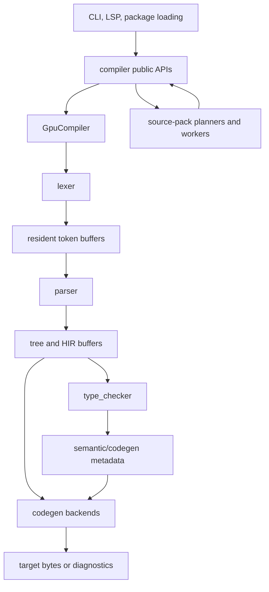

# Compiler Architecture

This document is the compiler-author orientation layer. Use it when you need to
decide where a change belongs before opening a pass file, shader, source-pack
record, or diagnostic mapper.

The detailed subsystem chapters explain each phase. The generated reference
lists exact current names, files, shader load sites, buffer carriers, and status
codes. This page explains the ownership model that keeps those pieces coherent.
Use [Compiler orchestration](compiler-orchestration.md) for the detailed
`GpuCompiler` operation flow and retained-buffer handoff rules.

## Architectural Shape

The compiler is a GPU-resident pipeline with a host-side control plane. The host
does not walk a full AST for normal compilation. Instead, it records GPU passes,
submits them at phase boundaries, reads only the status/count/output buffers
needed for the next boundary, and retains explicit buffer wrappers when later
phases need data from earlier phases.



The main layers are:

| Layer | Owner | Responsibility |
| --- | --- | --- |
| User/control surface | `cli`, root `README.md`, user docs | Commands, argument validation, package loading, diagnostic rendering, LSP and formatter entry points. |
| Compiler orchestration | `compiler`, `compiler/gpu_compiler` | Public compile/check APIs, phase sequencing, resident lock, retained buffer wrappers, source-pack execution, diagnostic mapping. |
| GPU infrastructure | `gpu`, `reflection`, `shader_artifacts` | Device, pass construction, reflection-driven bind groups, buffer wrappers, submission, readback, timing, tracing. |
| Frontend phases | `lexer`, `parser` | Tokenization, parser table application, tree recovery, HIR construction, parser status. |
| Semantic phase | `type_checker` | Module paths, names, types, calls, methods, predicates, visibility, retained backend metadata, type status. |
| Backend phases | `codegen::x86`, `codegen::wasm` | Target-specific recording after successful frontend/type-check boundaries. |
| Build graph planning | `codegen::unit`, `compiler::source_pack` | Source-pack units, jobs, artifacts, manifests, work queues, persisted progress. |

## One Compiler Instance

`compiler::GpuCompiler` is the central live object. It owns:

- a `GpuDevice`
- one loaded lexer driver
- one loaded parser driver
- precomputed parse tables
- one resident type checker
- optional backend generators
- a `resident_pipeline_lock`

The lock matters. Lexer, parser, type-checker, and backend paths reuse resident
buffers and bind-group caches. Public compile/check methods take the lock before
recording resident pipeline work so one operation cannot observe another
operation's cached buffers or transient bind groups.

Backend initialization is deferred as an operation-facing error. Frontend-only
operations can still run when a backend is disabled or failed to initialize.

## Lifecycle Of One In-Memory Check

A normal `type_check_source` operation follows this shape:

1. Prepare source text for GPU input and preserve the diagnostic path.
2. Take `resident_pipeline_lock`.
3. Record lexing and read token count.
4. Ask the parser to project tree capacity from resident tokens and parse
   tables.
5. Record parser LL/HIR work into a parser encoder.
6. Submit the parser boundary and read parser status.
7. If parser status rejects, map token/file data into a source diagnostic and
   stop.
8. Retain the parser buffers required by type checking.
9. Release parser resident buffers that no longer belong to later phases.
10. Record type checking into the original pipeline encoder.
11. Submit the type-check boundary and decode type-check status.

This shape is deliberately not a single monolithic GPU submission. Capacity
selection, parser status, and type-check status are phase boundaries. They are
the places where the host has enough information to size later buffers or return
a user-facing diagnostic.

## Lifecycle Of One x86 Compile

The x86 path extends the check path:

1. Run lexing and parser HIR construction.
2. Read parser status and semantic HIR count.
3. Retain parser buffers needed for x86 diagnostics and backend lowering.
4. Record and finish type checking.
5. Retain type-check metadata through `GpuX86CodegenBuffers`.
6. Measure x86 feature usage over HIR/type-check metadata.
7. Record x86 ELF construction from parser HIR plus retained semantic metadata.
8. Submit the backend boundary and map backend status/output.

The x86 backend must not borrow arbitrary parser/type-check scratch buffers. If
metadata survives the frontend boundary, it should appear in an explicit
retained wrapper. Reusing dead frontend buffers as backend scratch is allowed
only at a documented arena-lifetime boundary.

## Resident State And Retention

Resident state is a performance feature with ownership consequences.

The lexer and parser cache buffers sized for recent inputs. The type checker has
a resident state keyed by capacity and buffer identities. Backends have
recording helpers and bind groups built from reflected shader layouts.

The rule is:

- Borrowed `wgpu::Buffer` references are valid only while the owner phase is
  recording.
- `LaniusBuffer<T>` wrappers carry typed count/byte-size information and are the
  preferred representation for retained phase data.
- If a later phase needs data after an earlier phase releases its resident
  cache, clone the underlying buffer handle into an owned retained wrapper.
- If a new buffer affects a bind group used by the resident type-check cache,
  add it to the resident fingerprint instead of assuming the raw handle is
  harmless.

Use the generated reference's buffer-carrier table to locate current retained
wrappers and large buffer structs.

## Data Contracts

Each phase owns a different representation:

| Representation | Owner | Notes |
| --- | --- | --- |
| Source bytes and file metadata | lexer/compiler source-pack loaders | Source-pack paths preserve file ids, paths, and source ranges for diagnostics. |
| Tokens | lexer | Token rows, token count, token file ids, and source-file boundary buffers feed parser/type-check diagnostics. |
| Parser tree | parser | LL/tree topology records are parser-owned until retained by later phases. |
| Semantic HIR | parser | Dense semantic nodes and typed HIR record families are the main frontend product. |
| Semantic metadata | type checker | Resolved declarations, type refs, calls, methods, predicates, visibility, and backend metadata. |
| Backend records | codegen backends | Target-specific instruction/layout/output buffers and backend status. |
| Persisted build records | source-pack planners/store | Versioned manifests, pages, indexes, progress records, and work queue state. |

Do not move a responsibility across these boundaries just because a nearby file
has convenient access to a buffer. For example, parser passes may discover HIR
shape, but type resolution belongs in `type_checker`; source-pack path loading
may compute file metadata, but semantic module identity still comes from GPU
parsed module/import records.

## Status And Diagnostics

The compiler reports semantic failures through status buffers whenever possible.
The host's job is to map the status word back to a source location and stable
diagnostic code.

The diagnostic boundary is owned by the phase that has enough evidence:

| Failure | Owning evidence | Expected result |
| --- | --- | --- |
| Source loading or argument validation | CLI/compiler input layer | Immediate `CompileError::Diagnostic` or setup error. |
| Lexer setup/readback failure | lexer/compiler boundary | Frontend error; structured diagnostic only when source location exists. |
| Parser LL rejection | parser status plus token buffers | Syntax diagnostic with token/file label. |
| Type-check rejection | type status plus token/HIR/source-pack metadata | Semantic diagnostic with primary source label. |
| Backend rejection | backend status plus retained parser/type metadata | Backend diagnostic or target-level error. |
| Persisted source-pack mismatch | store/validation layer | Contract diagnostic/error tied to manifest or artifact path. |

When adding a new rejection path, first decide which phase owns the evidence,
then wire status, readback, mapping, and tests at that boundary. Do not add a
host-side special case that guesses what the shader meant after the owning
status data has been discarded.

## Source Packs And Build Graphs

Source packs are not just a multi-file wrapper around single-source compile.
They introduce a build graph:

- source files belong to libraries
- libraries have dependency edges
- frontend/codegen units are bounded by source counts and byte counts
- jobs emit interface, object, or linked artifacts
- persisted builds write manifests, pages, shards, progress records, and work
  queues

`codegen::unit` owns target-independent unit/job/artifact planning. The
`compiler::source_pack` and public planning/execution APIs own persisted
preparation, filesystem stores, validation, worker claims, progress updates, and
resumption.

If a change affects only language semantics, start in parser/type-check/codegen.
If it affects how work is split, resumed, claimed, or linked across files, start
in source-pack planning and store validation.

## Choosing The Right Edit Point

Use this routing table before editing:

| Change | First place to inspect | Main docs to update |
| --- | --- | --- |
| New CLI flag or output mode | `cli`, `compiler` public APIs | `cli.md`, diagnostics docs if output changes |
| New maintainer tool, generated input, or tool option | `crates/laniusc-compiler/src/bin`, `tools`, `grammar`, `tables` | `maintainer-tools.md`, `grammar-and-tables.md` for token/grammar/table contracts, `building.md` if command routing changes |
| New stdlib module or helper contract | `stdlib`, source-root/package loaders, owning semantic/backend phase if executable | `standard-library.md`, `module-resolution.md` or `package-metadata.md` if loading changes |
| New formatter rule or mode | `formatter`, `cli/fmt`, `cli/lsp/document` | `formatter.md`, `cli.md`, `lsp.md` if LSP changes |
| New `GpuCompiler` operation or retained phase handoff | `compiler/gpu_compiler` | `compiler-orchestration.md`, `public-api.md` if the caller surface changes, generated reference if buffer carriers change |
| New token or lexical rule | lexer tables/passes | `lexer.md`, `grammar-and-tables.md` if token IDs or generated constants change, generated reference if public/pass surfaces change |
| New syntax shape | parser pass family and HIR records | `parser.md`, `grammar-and-tables.md` if grammar or production IDs change, `algorithms.md`, generated reference |
| New capacity, row stride, or user-visible limit | owning phase allocator/status mapper | `capacity-and-limits.md`, owning phase guide, diagnostics if user-visible |
| New name/module visibility rule | `type_checker::module_path`, name/visible pass families | `type-checker.md`, `algorithms.md`, diagnostics |
| New type relation or type instance behavior | `type_checker::bind_support`, `record`, resident buffers | `type-checker.md`, generated reference |
| New diagnostic | owning phase status mapper | `diagnostics.md`, subsystem guide, tests |
| New LSP protocol behavior | `cli/lsp` | `lsp.md`, `cli.md`, diagnostics docs if payloads change |
| New x86 lowering behavior | `codegen::x86` record/finish helpers | `codegen.md`, backend status docs |
| New WASM lowering behavior | `codegen::wasm` | `wasm-backend.md`, `codegen.md` |
| New source-pack unit or artifact rule | `codegen::unit`, `compiler::source_pack` | `source-packs.md`, generated reference |
| New persisted file/page/index | store, manifest, validation modules | `source-packs.md`, version/validation docs |
| New shader or bind group | owner phase plus `gpu`/reflection helpers | `gpu-passes.md`, subsystem guide, generated reference |

If a proposed change touches three or more ownership rows, write down the phase
contract first. Broad edits are sometimes necessary, but they should not be
driven by whichever file is easiest to patch.

## Generated Facts Versus Narrative

Hand-written docs should explain ownership and invariants. Generated docs should
own volatile listings.

Use `generated/reference.md` for:

- current public compiler operation signatures
- stable diagnostic code registry rows
- shader load sites and imports
- type-check pass loaders and record sites
- Rustdoc coverage
- buffer carriers and large structs
- status-code inventories

Use the relationship map for coupling and file-layout evidence:

```bash
tools/repo_map.py
tools/repo_map.py --svg /tmp/laniusc-repo-map.svg --png /tmp/laniusc-repo-map.png
```

If a narrative chapter needs to name a volatile pass or buffer, it should either
explain why that specific item matters or link readers to the generated
reference.

## Verification Expectations

Match verification to the kind of compiler change:

| Change type | Minimum useful evidence |
| --- | --- |
| Rustdoc/comment-only | generated reference check, rustfmt check if Rust files changed, markdown/link hygiene if docs changed |
| Generated reference input | regenerate `docs/compiler/generated/reference.md` and run `--check` |
| Shader load/bind layout | focused compile path or pass construction test plus generated reference check |
| Parser behavior | smallest source that exercises the syntax plus parser/status diagnostic check |
| Type-check behavior | smallest source that exercises the semantic relation plus diagnostic/status check |
| Capacity or limit behavior | smallest source that crosses the relevant boundary, proving either no rejection or a source-labeled diagnostic |
| Backend behavior | smallest source that reaches the backend path plus backend status/output check |
| Source-pack planning | focused planning/store validation test with small libraries and dependency edges |
| Work queue execution | claim/execute/complete/resume evidence for the affected record family |

Broad cargo or GPU benchmark runs are useful checkpoints, but they do not
replace a small source or record fixture that proves the changed contract.

## Documentation Update Rule

Update this architecture guide when ownership changes. Update the subsystem
chapters when phase order, buffer lifetimes, pass families, diagnostics,
source-pack records, or backend boundaries change. Regenerate the reference
when extracted facts change.

The target is the same shape as mature compiler documentation: a new maintainer
should be able to learn the model from narrative docs, confirm exact current
facts from generated docs, then use Rustdoc/source/tests for item-level detail.
