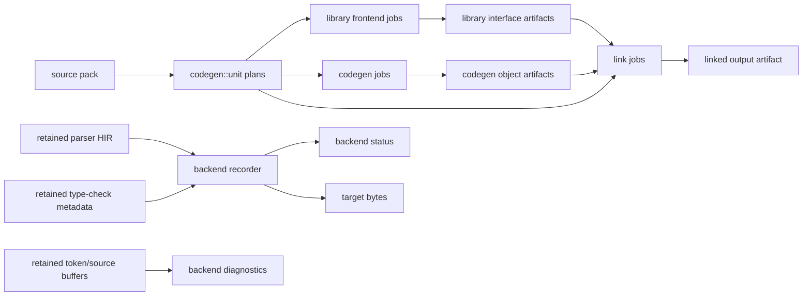

# Codegen And Backends

Codegen starts only after parser status and type-check status have both
succeeded. The backend must treat parser HIR and retained type-check metadata as
the source of truth. It should not recover semantic meaning from source text,
file names, or frontend implementation details that are not carried through
records.

This chapter covers two related but separate areas:

- target-independent source-pack unit/job/artifact planning in `codegen::unit`
- target-specific GPU backend recording in `codegen::x86` and `codegen::wasm`

For the current pass, shader, buffer, and status inventories, use
`generated/reference.md`.

## Ownership

| Area | Responsibility |
| --- | --- |
| `compiler/gpu_compiler/*_codegen.rs` | Orchestrates frontend success checks, retained buffers, backend calls, and diagnostic mapping. |
| `codegen::unit` | Builds target-independent source-pack unit, job, artifact, batch, shard, and work-queue plans. |
| `codegen::x86` | Records GPU x86_64/ELF lowering from parser HIR plus retained type-check metadata. |
| `codegen::wasm` | Records the current WASM backend boundary and its fail-closed backend diagnostics. |
| `shaders/codegen` | Implements backend passes and status production. |

`codegen::unit` answers "which bounded job should run and which artifacts does
it consume or produce?". A backend answers "given one bounded frontend result
plus type metadata, how do I lower it to target bytes?".

Keep those questions separate. Source-pack planning must not depend on the
current x86 or WASM lowering implementation, and backend lowering must not
invent its own source-pack schedule.

## Entry Points

The public compile methods live on `GpuCompiler`:

| Entry point family | Target | Notes |
| --- | --- | --- |
| `compile_source_to_x86_64*` | x86_64 ELF/object bytes | Single source string or path. Uses a synthetic `<source>` path for in-memory input. |
| `compile_source_pack_to_x86_64*` | x86_64 source pack | Validates the pack fits the default in-memory codegen unit before running frontend/backend work. |
| `compile_source_pack_manifest_to_x86_64` | x86_64 explicit pack | Preserves manifest source paths for diagnostics. |
| `compile_source_to_wasm*` | WASM bytes or backend diagnostic | Same frontend shape as x86, but current backend fails closed for unsupported shapes. |
| `compile_source_pack_to_wasm` | WASM source pack | Uses source-pack diagnostic files but keeps WASM backend status mapping narrower than x86. |

Backend generators are optional fields on the compiler. `x86_generator()` and
`wasm_generator()` turn missing or failed initialization into
`CompileError::GpuCodegen`. CLI commands can still expose frontend-only
operations when a backend is unavailable.

## Data Flow

For in-memory compile entry points, the compiler builds the same frontend data
without persisting the full source-pack artifact graph. For descriptor/work-queue
paths, the plan is serialized so workers can claim bounded jobs and validate
artifact dependencies before running GPU work.

## Backend Boundary

The backend receives records, not syntax trees:

- parser HIR topology: node kind, parent/subtree links, semantic kind, token
  span, and typed HIR record families
- source/token buffers retained for diagnostics and backend token labels
- type-check metadata for visible declarations, resolved value/type refs,
  function rows, call rows, method receiver rows, type-instance rows, aggregate
  rows, predicates, and entrypoint tags
- target feature summaries used to size backend-specific buffers
- backend status buffers that report target-specific rejection details

The compiler must retain parser and type-check buffers needed by the backend
before releasing resident frontend caches. Do not borrow a parser or type-check
scratch buffer past its lifetime boundary unless it has been explicitly cloned
into an owned retained wrapper or documented as dead scratch for the backend
recording.

## x86_64 Orchestration

The x86 path has two submission boundaries after lexing:

1. A parser boundary records token frontend, LL, tree, HIR, and semantic-HIR
   count readback. The compiler submits it and checks parser status before type
   checking records against the parser rows.
2. A backend boundary records x86 lowering after type checking has succeeded and
   x86-specific type-check metadata has been retained.

The high-level x86 sequence is:

1. Lex source or source pack into resident token buffers.
2. Read exact parser tree capacity with `read_resident_projected_tree_capacity`.
3. Record parser LL/HIR work with that tree capacity.
4. Submit parser boundary and read parser status.
5. Read semantic HIR count and derive active tree capacity.
6. Clone parser rows into `OwnedTypecheckParserBuffers` and
   `OwnedX86ParserBuffers`.
7. Release the parser cache and poll the device so old resident storage can be
   reused safely.
8. Record type checking from retained parser buffers.
9. Submit/finish type checking and take `OwnedGpuX86CodegenBuffers`.
10. Measure x86 feature usage from HIR/statement/expression records.
11. Plan x86 capacities and scratch rows.
12. Record x86 ELF lowering with `record_elf_from_hir`.
13. Submit backend boundary and read output/status.
14. Map backend status to a diagnostic or return target bytes.

The x86 backend is the model for new backend work because it has the clearest
separation between frontend status, retained metadata, feature measurement,
capacity planning, backend status, and source-label mapping.

See [x86 backend internals](x86-backend.md) for the detailed x86 source map,
recording pass families, scratch rules, status readback, bounded contracts, and
authoring checklist.

## x86_64 Inputs

`RecordElfInputs` is the x86 recording contract. It groups inputs by role:

| Group | Examples | Source |
| --- | --- | --- |
| Global shape | source length, token capacity, HIR count, instruction-HIR count | compiler orchestration |
| Parser status/topology | LL status, active HIR dispatch args, HIR kind, item kind, parent, subtree end | `OwnedX86ParserBuffers` |
| Function metadata | item decl/name tokens, HIR token position, return type node, param record, enclosing function, method receiver metadata | parser plus type checker |
| Expression metadata | expression record, result root, int value, statement record, type form/length | parser HIR |
| Call metadata | callee/argument parser rows plus resolved call rows and return/parameter type rows | parser plus type checker |
| Array/enum/struct metadata | aggregate parser rows plus resolved declarations and field ordinals | parser plus type checker |
| Type metadata | declaration type refs, visible type rows, type-instance records | type checker |
| Entrypoint and visibility | visible declarations, function entrypoint tags | type checker |
| Feature summary | enum/match/aggregate/call counts and scalar instruction estimate | x86 feature-count pass |
| External scratch | documented dead buffers borrowed from retained frontend rows | compiler x86 boundary |

If a new x86 pass needs a semantic fact, first identify the parser or type-check
row that owns it. If no such row exists, add it to the owning frontend phase
before extending x86.

## x86_64 Capacity Model

x86 capacities are host-planned before full backend recording. The capacity
model uses:

- HIR row count
- token capacity
- instruction-basis row count
- measured feature summary
- minimum/slack constants
- maximum instruction cap

Feature measurement counts enum, match, aggregate, call, parameter, and scalar
instruction evidence. For scalar-only programs, the measured scalar estimate can
avoid allocating a broad default instruction budget. For programs using more
complex features, the backend falls back to conservative capacity estimates.

Important capacity facts:

| Fact | Meaning |
| --- | --- |
| `X86_INST_CAPACITY_MIN` | Minimum instruction rows for a backend recording. |
| `X86_INST_CAPACITY_SLACK` | Extra rows added to estimates to avoid tight caps. |
| `MAX_X86_INSTS` | Hard upper bound for instruction capacity. |
| `x86_capacity_estimate_for_hir_tokens_inst_basis_and_feature_summary` | Main estimator used by the backend record path. |
| `x86_function_slot_capacity` | Function-slot estimate based on instruction-HIR count, HIR rows, and token density. |
| `x86_initial_output_readback_bytes` | Initial readback size for output/status validation. |

Capacity exhaustion must fail closed through backend status. A warning that an
estimate hit a cap is not a correctness mechanism; it is a signal that exact GPU
instruction-count projection is needed for larger programs.

## x86_64 Recording Stages

`codegen::x86::record` is intentionally split into small modules:

| Module | Role |
| --- | --- |
| `capacity` | Computes row counts, scan steps, dispatch groups, and tracing facts. |
| `buffers` and `allocation` | Allocate or reuse backend storage for metadata, instructions, output, and status. |
| `metadata_bind_groups` and `metadata_dispatch` | Discover functions and build backend metadata dispatch inputs. |
| `semantic_bind_groups` | Bind parser/type-check metadata for semantic record passes. |
| `calls`, `enum_match_bind_groups`, `emit_bind_groups` | Build target-specific record groups for calls, enums/matches, and output. |
| `inst_plan_bind_groups` and `inst_gen_bind_groups` | Plan per-node instruction rows and generate virtual instruction rows. |
| `virtual_bind_groups` and `dispatch_recording` | Record virtual liveness, next-call, register-allocation, and emit dispatches. |
| `status_trace` | Optionally reads status buffers for debugging. |
| `retained` and `finish` | Retain output/status readbacks and decode final bytes. |

The record function contains many explicit scratch reuses. Each reuse is only
valid because the earlier producer has been copied to a stable row or is no
longer read by later stages. When changing the order, revalidate every reuse
near that block. A borrowed scratch buffer is not a semantic input.

## x86_64 Bounded Contracts

The x86 backend exposes documented pass contracts for known bounded regions:

| Contract | Current status | Replacement direction |
| --- | --- | --- |
| `x86_encode_pass_contract` | Bounded-local byte loop, fail-closed, not blocking; source text is not consumed. | Keep encoded bytes per instruction guarded by size/status checks. |
| `x86_regalloc_pass_contract` | Bounded and blocked; rows per chunk must cover instruction capacity. | Replace with function-region value-definition rows, segmented state composition, and pressure/spill scans. |
| `x86_control_flow_bridge_pass_contract` | Bounded and blocked; bridges control relations before virtual generation. | Replace with basic-block edge rows, control-region records, and segmented control-flow scans. |
| `x86_lowering_pass_contract` | Bounded and blocked; function-body recognizers are forbidden. | Replace shape-specific lowering with generic operation records, block edges, and segmented virtual-instruction scatter. |

These contracts are not decorative comments. Tests and trace output use them to
make bounded backend behavior auditable. If a bounded loop remains, its status
path must fail closed and identify the HIR node or token that made the backend
reject the program. If normal user code can plausibly hit the bound, remove the
bound rather than adding compatibility around it.

## x86_64 Diagnostics

`X86OutputError` carries:

- an error name
- a numeric backend status code
- a detail word

The compiler maps detail words to source labels by asking the error whether the
detail is a token or a HIR node:

- token details are read directly from retained lexer token rows
- HIR-node details are mapped through retained `hir_token_pos`
- unaddressable details fall back to the first non-whitespace source span

Single-file and source-pack paths use separate helpers because source-pack token
spans are global byte offsets that must be mapped back to a diagnostic file.
When adding a status, prefer a detail payload that can map to a token or HIR
node. A target-level status with only a numeric detail is acceptable for truly
global backend failures, but it is worse for users and maintainers.

## WASM Boundary

The WASM backend consumes the same broad frontend shape as x86: parser HIR,
type-check codegen metadata, token/source buffers, and backend status buffers.
Its current role is narrower. It records explicit stages and fails closed for
unsupported output shapes instead of silently producing partial WASM.

WASM resident state is cached by:

- input buffer fingerprint
- output capacity
- token capacity
- HIR node capacity

The input fingerprint includes every parser/type-check/source buffer used by
the bind groups. If a new WASM pass reads a buffer, add it to the fingerprint;
otherwise the resident bind groups can point at stale input.

## WASM Recording Stages

`wasm_record_boundaries()` exposes the current WASM stage contract:

| Stage | Purpose |
| --- | --- |
| `agg_layout_clear` | Clears aggregate layout records. |
| `agg_layout` | Computes aggregate layout records from HIR and struct metadata. |
| `const_values` | Extracts backend constant-value rows. |
| `hir_body` | Attempts body generation and writes body/status rows. |
| `hir_agg_body` | Keeps aggregate-body boundary explicit while failing closed for unsupported shapes. |
| `hir_enum_match_records` | Builds enum/match records for backend use. |
| `module` | Builds module words from body words/status. |
| `hir_assert_module` | Keeps assertion boundary explicit. |
| `pack_output` | Packs output words after status succeeds. |

WASM status uses four words: output length, mode, error code, and error detail.
`WasmOutputError::detail_is_token` identifies the subset of details that can be
read as token indices. Source-pack WASM diagnostics map token spans back to the
owning source file when possible and otherwise fall back to the first file.

See [WASM backend internals](wasm-backend.md) for the detailed WASM source map,
retained input groups, resident buffer cache, recording stage order,
status/output readback path, diagnostic mapping, and WASM authoring checklist.

## Source-Pack Planning

`codegen::unit` models source-pack compilation as bounded records:

| Model | Meaning |
| --- | --- |
| `LibraryUnit` | Contiguous files from one library. |
| `FrontendUnit` | Bounded frontend/type-check work that emits interface data. |
| `CodegenUnit` | Bounded codegen work that emits object data. |
| `SourcePackJob` | Scheduled library-frontend, codegen, or link operation. |
| `SourcePackArtifactPlan` | Artifact produced by a job. |
| `SourcePackBuildArtifactManifest` | Serializable manifest for jobs, batches, artifact IO, artifact uses, and link batches. |
| `SourcePackBuildArtifactShard` | Bounded manifest slice for filesystem/work-queue execution. |

Unit construction preserves source order and never splits one source file. If a
single file exceeds the unit limit, the plan emits an oversized one-file unit so
callers can route or reject it explicitly.

Job schedules are acyclic. Frontend jobs produce library interface artifacts,
codegen jobs produce object artifacts, and link jobs consume interfaces/objects
to produce final linked output. Dependency ranges compact contiguous job or
artifact dependencies so large packs do not repeat every edge in every persisted
record.

The build-manifest layer has two modes:

- compact manifests retain counts and summaries
- retained manifests keep full schedules, batches, dependencies, artifacts,
  artifact IO, artifact uses, and link batches

Target-specific artifact keys are namespaced through `SourcePackArtifactTarget`.
Do not bake target names into unrelated planning records.

## Diagnostic Boundary

Backends report compact status words. The orchestration layer owns mapping those
words into `CompileError::Diagnostic`:

- If the backend detail is a token, label the token span.
- If the backend detail is a HIR node, map through HIR token span/file records.
- If the backend only has a target-level failure, emit a backend diagnostic with
  enough detail for a compiler author to find the status constant.

Adding a backend status requires updates to the shader/Rust status mapping and
the generated reference. If the status can point at source but currently does
not, treat that as incomplete diagnostics work.

## Adding x86_64 Behavior

Use this checklist when adding x86_64 backend behavior:

1. Identify the parser/type-check record that owns the semantic fact.
2. Add the row to `OwnedX86ParserBuffers` or `OwnedGpuX86CodegenBuffers` if the
   backend needs it after the frontend cache is released.
3. Add a typed metadata group field when several passes need the same buffer.
4. Extend feature measurement only if capacity or optional pass execution
   depends on the new shape.
5. Update capacity planning if the pass allocates rows proportional to HIR,
   tokens, instructions, functions, or feature counts.
6. Allocate owned storage or explicitly document dead scratch reuse.
7. Record the new pass in dependency order.
8. Add backend status for unsupported or invalid shapes.
9. Map status detail to a token or HIR node whenever possible.
10. Add a smallest-source test that reaches the new backend path.
11. Regenerate `docs/compiler/generated/reference.md`.

When the required semantic fact does not exist in parser or type-check output,
add it there first. Backend reconstruction of language semantics is a phase
boundary bug.

## Adding WASM Behavior

Use this checklist when extending WASM:

1. Add or reuse parser/type-check metadata rows rather than reading source text.
2. Add every new input buffer to the WASM input fingerprint.
3. Add resident storage and bind groups for the new stage.
4. Add the stage to `WASM_RECORD_BOUNDARIES` if it is a durable recording
   boundary.
5. Initialize status so unsupported paths fail closed.
6. Make status detail source-addressable when possible.
7. Update source-pack diagnostic mapping if the detail uses global token spans.
8. Add the smallest compile test that proves the shape either emits bytes or
   reports the expected backend diagnostic.
9. Regenerate `docs/compiler/generated/reference.md`.

## Adding Source-Pack Planning Behavior

Use this checklist when changing `codegen::unit`:

1. Decide whether the rule belongs to library units, frontend/codegen units,
   jobs, artifacts, batches, link batches, or build-manifest shards.
2. Preserve source order and never split one source file.
3. Represent oversized work explicitly instead of hiding it in a normal bounded
   record.
4. Keep schedules acyclic and make schedule errors report unscheduled job
   indices.
5. Compact contiguous dependency/artifact ranges when large packs would
   otherwise duplicate records.
6. Keep target-specific behavior behind `SourcePackArtifactTarget` or the
   backend execution layer.
7. Add summary methods or tests for the new bound so generated docs and
   maintainers can inspect it.
8. Update `source-packs.md` if persisted manifests, work queues, or artifact
   store contracts change.

## Common Mistakes

| Mistake | Better boundary |
| --- | --- |
| Reconstructing syntax in backend shaders | Publish the syntax as parser HIR or type-check metadata first. |
| Keeping parser/type-check resident caches alive for backend convenience | Clone required rows into retained wrappers and release caches at the phase boundary. |
| Extending x86 scratch reuse without checking later reads | Prove the prior value is dead or allocate a real backend buffer. |
| Adding a backend status with only a numeric detail | Use a token or HIR node detail when source labeling is possible. |
| Treating feature measurement as semantic validation | Use it only for capacity and optional pass selection; semantic checks belong in type checking or explicit backend status. |
| Adding a source-pack planning rule to x86/WASM code | Put target-independent unit/job/artifact shape in `codegen::unit`. |
| Letting WASM silently succeed on unsupported output | Keep fail-closed status until the shape is actually supported. |

## Evidence To Update

When backend behavior changes, keep these evidence paths current:

- `docs/compiler/generated/reference.md` for shader load sites, buffer carriers,
  status layouts, and large structs
- focused x86/WASM tests for the smallest source that reaches the new target
  path
- diagnostics tests when backend status or source-label mapping changes
- source-pack tests when unit/job/artifact planning changes
- performance checks when capacity estimates, bounded loops, feature
  measurement, or scratch reuse change
- `source-packs.md` when persisted manifests, descriptors, work queues, or
  artifact stores change

For docs-only edits to this chapter, `tools/compiler_inventory.py --check
docs/compiler/generated/reference.md`, Markdown link checking, whitespace
checks, and ASCII checks are enough. Compiler tests are only needed when backend
code, source-pack planning code, generated reference inputs, or public behavior
changes.
