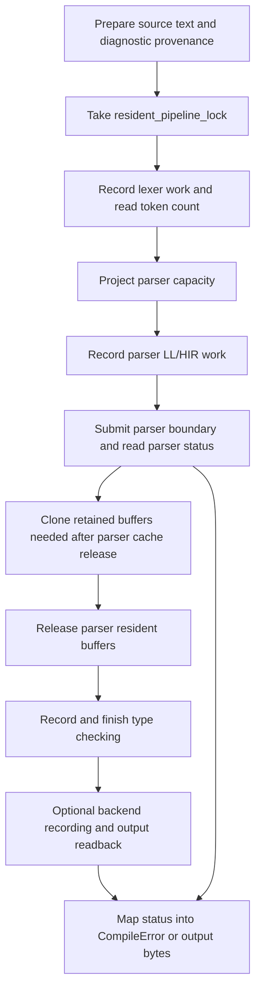

# Compiler Orchestration

This chapter documents the live compiler driver layer: `GpuCompiler` and the
host-side sequencing around resident lexer, parser, type-checker, backend, and
source-pack executor state.

Use this chapter when changing the order of compiler phases, backend
availability, retained buffer wrappers, diagnostic handoff data, descriptor
workers, or host-side timing around compile/check operations. Use
[Public compiler API](public-api.md) for the caller-facing function taxonomy and
[Data flow](data-flow.md) for the end-to-end representation map.

## What This Layer Owns

The orchestration layer owns the host decisions that cannot live inside one GPU
phase:

- construction of one compiler instance around one `GpuDevice`
- backend family selection and deferred backend initialization errors
- resident pipeline serialization
- phase order for check, WASM compile, and x86 compile operations
- capacity decisions that require earlier phase counts or status
- retained buffer wrappers that outlive a phase cache
- conversion from parser, type-checker, WASM, and x86 status into
  `CompileError`
- descriptor-worker execution through the compiler as a GPU executor
- host timing and trace labels around compiler boundaries

It should not own language semantics, parser HIR meaning, type relation policy,
backend instruction selection, source-pack graph planning, or diagnostic text
that belongs to a stable diagnostic constructor. It is the coordinator between
those owners.

## Source Map

| Source | Responsibility |
| --- | --- |
| `compiler/gpu_compiler.rs` | Main `GpuCompiler` struct, construction path, module wiring, parse-table loading, backend initialization. |
| `compiler/gpu_compiler/backends.rs` | `GpuCompilerBackends` selectors for all, frontend-only, WASM-only, and x86-only instances. |
| `compiler/gpu_compiler/typecheck.rs` | Single-source and source-pack type-check orchestration, parser boundary handling, type-check recording, type-check diagnostic mapping. |
| `compiler/gpu_compiler/wasm_codegen.rs` | WASM compile orchestration, WASM backend access, WASM backend diagnostic mapping, WASM trace stages. |
| `compiler/gpu_compiler/x86_codegen.rs` | x86 compile orchestration, parser/type-check retention, feature measurement, x86 backend recording, x86 diagnostic mapping. |
| `compiler/gpu_compiler/buffers.rs` | Owned lexer/parser buffer wrappers retained after phase caches are released. |
| `compiler/gpu_compiler/helpers.rs` | Shared capacity clamps, source preparation, WASM trace helper, and type-mismatch diagnostic detail decoding. |
| `compiler/gpu_compiler/descriptor_work_queue.rs` | `GpuCompiler` methods that prepare, claim, run, or step persisted descriptor work queues. |
| `compiler/gpu_compiler/source_pack_executor.rs` | Descriptor-emitting source-pack executor used by work-queue execution. |
| `compiler/gpu_compiler/host_timer.rs` | Host-side timing and pipeline-cache sampling controlled by environment flags. |
| `compiler/gpu_compiler/benchmarks.rs` | Measurement-only compiler entry points used by tools. |

The public function list and exact signatures belong in the generated reference
and Rustdoc. This chapter describes ownership and sequencing.

## Compiler Instance Shape

`GpuCompiler` owns one live compiler pipeline:

| Field family | Meaning |
| --- | --- |
| `gpu` | The `GpuDevice` used by every phase driver and backend generator in this instance. |
| `lexer` | Resident GPU lexer driver. |
| `parser` | Resident GPU parser driver. |
| `parse_tables` | Precomputed parse tables loaded from checked-in binary table bytes. |
| `type_checker` | Resident GPU type-checker. |
| `resident_pipeline_lock` | Operation-level lock for resident phase reuse. |
| `wasm_generator` | WASM backend generator or deferred initialization error. |
| `x86_generator` | x86 backend generator or deferred initialization error. |

The instance is not just a bag of helpers. Phase drivers cache buffers and bind
groups, and the backend generators are tied to the same device. A compile/check
operation must treat the instance as one resident pipeline.

## Construction

There are three construction levels:

| Constructor | Behavior |
| --- | --- |
| `GpuCompiler::new` | Uses the process-global GPU device and initializes every backend family. |
| `GpuCompiler::new_with_device` | Uses a caller-provided `GpuDevice` and initializes every backend family. |
| `GpuCompiler::new_with_device_and_backends` | Uses a caller-provided device and a selected backend set. |

Frontend phases are always initialized:

1. create the lexer driver
2. create the parser driver
3. load parse tables from `tables/parse_tables.bin`
4. create the resident type checker

Backend initialization is selected by `GpuCompilerBackends`. If a requested
backend fails to initialize, the error is stored in the backend field and logged.
The compiler instance can still be used for frontend-only work. If a backend is
disabled or failed, the target-specific compile method reports that backend
error when the caller asks for that target.

Do not add host-side fallback compilation behind these fields. Backend absence
is an operation error, not permission to silently change target semantics.

## Backend Selectors

`GpuCompilerBackends` is intentionally small:

| Selector | WASM | x86 | Use |
| --- | --- | --- | --- |
| `all` | yes | yes | General compiler instance. |
| `frontend_only` | no | no | Check/type-check operations and tests that should not build backend pipelines. |
| `wasm_only` | yes | no | WASM compile paths. |
| `x86_only` | no | yes | x86 compile paths. |

Adding a backend should extend this selector deliberately. Do not encode backend
selection in stringly typed public helpers when the compiler can expose a
target-specific operation.

## Resident Pipeline Lock

Every compile/check method that records resident phase work takes
`resident_pipeline_lock` before entering lexer/parser/type-check/backend
recording.

The lock protects:

- lexer resident token buffers
- parser resident tree/HIR buffers
- parser cache release and re-acquisition
- type-checker resident state and codegen metadata
- backend recording paths that borrow retained frontend/type-check metadata

The lock does not make the whole process single-threaded. It serializes one
compiler instance. Callers that need concurrent compile operations should use
separate compiler instances or persisted source-pack workers.

Do not bypass the lock for a new async-looking method. If the method records
resident pipeline work, it must either take the lock or use a different compiler
instance.

## Phase Boundary Shape

Most orchestration methods follow this high-level shape:

The concrete shape differs by target, but the ownership boundary is stable:
capacity and status facts are read at phase boundaries, while large phase data
stays on the GPU and is retained only through explicit wrappers.

## Source Preparation

`prepare_source_for_gpu` currently preserves already-loaded source text as a
`String`. `prepare_source_for_gpu_from_path` reads text from disk and converts
read failures into `CompileError::GpuFrontend`.

Keep this layer narrow. Source preparation is allowed to preserve provenance and
normalize input representation. It should not perform parser recovery, type
resolution, module import interpretation, or backend-specific rewrites.

## Type-Check Operation

Single-source type checking:

1. prepares source text
2. preserves the diagnostic path, defaulting to `<source>` for in-memory input
3. takes the resident lock
4. records resident lexer work and receives token count
5. projects parser tree capacity from resident tokens and parse tables
6. records parser LL/HIR work in a parser-specific encoder
7. submits the parser boundary
8. reads parser status and returns a syntax diagnostic on rejection
9. clones parser buffers required by type checking into
   `OwnedTypecheckParserBuffers`
10. releases parser resident buffers
11. waits for device progress after release
12. records type-check work from retained parser/lexer buffers
13. finishes type-check status and maps rejection into source diagnostics

Source-pack type checking follows the same ownership shape, but diagnostics use
per-file source-pack metadata instead of one diagnostic path.

The parser boundary is deliberately separate. The host needs parser status and
the emitted HIR length before it can decide active HIR capacity and safely
record later work.

## WASM Compile Operation

WASM compile paths use the same frontend and type-check data, then record WASM
backend work through `GpuWasmCodeGenerator`.

Current behavior has two important target-specific details:

- single-source WASM compile preflights type checking before backend recording
  so expected user type errors do not execute backend passes
- WASM recording batches parser, type-check, and backend work through the parser
  recording callback path, then finishes parser status, type-check status, and
  WASM output in order

WASM backend access goes through `wasm_generator()`. If the backend was disabled
or failed at construction, that method returns a `CompileError::GpuCodegen`
instead of creating a fallback generator.

WASM backend errors are mapped to `LNC0036`. When the backend detail encodes a
token, the diagnostic maps the token back through retained token data. Otherwise
the label falls back to the first non-whitespace source span.

## x86 Compile Operation

x86 compile paths stage the backend boundary more explicitly:

1. record lexer work
2. project parser tree capacity
3. record parser LL/HIR work and semantic HIR count readback
4. submit the parser boundary
5. read parser status
6. read semantic HIR count
7. compute active HIR capacity
8. clone `OwnedTypecheckParserBuffers` for type checking
9. clone `OwnedX86ParserBuffers` for backend lowering and diagnostics
10. release parser resident buffers
11. clone `OwnedX86DiagnosticBuffers` from lexer buffers
12. record and finish type checking
13. take x86 codegen metadata from the resident type checker
14. measure x86 feature usage
15. record x86 backend work into a separate backend encoder
16. submit the x86 backend boundary
17. read backend output or map backend status into a diagnostic

x86 backend access goes through `x86_generator()`. Disabled or failed x86
initialization is reported as a codegen error at the target operation boundary.

x86 backend errors are mapped to `LNC0017`. The diagnostic mapper uses retained
parser HIR token-position data plus retained lexer token rows when possible, and
falls back to a source-pack or single-source label when exact token mapping is
not available.

## Retained Buffer Wrappers

Retained wrappers are the contract that lets orchestration release a phase cache
without losing data required by later work.

| Wrapper | Purpose |
| --- | --- |
| `OwnedTypecheckParserBuffers` | Parser tree/HIR/token-position rows required to record type checking after parser resident buffers are released. |
| `OwnedX86ParserBuffers` | Parser HIR rows required by x86 lowering and x86 diagnostic mapping. |
| `OwnedX86DiagnosticBuffers` | Lexer token rows and source length required by x86 diagnostic mapping. |
| `DiagnosticTokenBuffer` | Source-pack type-check diagnostic token data retained across async finish boundaries. |
| `WasmDiagnosticBuffers` | Source-pack WASM token data retained for backend diagnostic mapping. |

The wrapper name should describe the consumer and lifetime. Do not pass raw
phase buffers through arbitrary closures just because the borrow checker allows
it in one local path. If the data survives phase release, make the retained
ownership visible.

When adding a field to a retained wrapper, update:

- the wrapper struct
- its `from_*_buffers` constructor
- the consuming backend/type-check metadata struct
- the relevant diagnostic mapper if the field changes source mapping
- generated reference if the buffer-carrier table is affected
- tests that prove the new handoff at the public behavior boundary

## Scratch Aliasing

Some backend/type-check helpers reuse dead frontend buffers as scratch. That is
allowed only when the lifetime boundary is explicit.

Examples in the current code:

- `typecheck_external_scratch_from_frontend_buffers` documents which parser or
  lexer workspaces are dead before type-check scratch use
- `x86_external_scratch_from_frontend_buffers` documents parser HIR/type
  workspaces that are not read by the x86 backend input surface
- `buffer_if_wgpu_u32_words` checks raw `wgpu::Buffer` byte capacity before a
  buffer is offered as optional scratch

Scratch aliasing must not hide a live data dependency. If a later pass reads a
row as semantic evidence, that row is not scratch. Move scratch selection behind
a helper and document the consumed-before/reused-after ordering there.

## Capacity Helpers

The orchestration layer owns small capacity clamps that bridge phase status to
backend allocation:

| Helper | Contract |
| --- | --- |
| `hir_node_capacity_for_parser_emit` | Uses parser emitted HIR length, at least one, capped by parser tree capacity. |
| `x86_inst_hir_node_count_for_backend_capacity` | Uses semantic HIR count, at least one, capped by active parser tree capacity. |

These helpers are not semantic limits. They translate already-measured phase
facts into capacities for the next recorder. If a feature needs a higher
language limit, change the underlying representation or phase algorithm, not
only the clamp.

## Diagnostic Mapping

The orchestration layer maps status into `CompileError` because it has access to
both phase status and source provenance.

| Failure source | Mapping inputs | Result shape |
| --- | --- | --- |
| Parser LL rejection | parser status, token buffer, source or source-pack files | syntax diagnostic or parser setup error |
| Type-check rejection | type-check status, token/HIR details, lexer tokens, diagnostic source files | semantic diagnostic or type-check setup error |
| WASM backend rejection | `WasmOutputError`, token buffer, source provenance | `LNC0036` diagnostic when structured, otherwise codegen error |
| x86 backend rejection | `X86OutputError`, retained parser HIR token positions, retained lexer tokens, source provenance | `LNC0017` diagnostic when structured, otherwise codegen error |

When adding a new status code, prefer this order:

1. make the owning phase return enough detail to identify source evidence
2. retain the smallest buffer rows needed by the mapper
3. map to a stable diagnostic constructor
4. preserve generic string errors only for infrastructure failures or temporary
   gaps where source evidence is not available

Do not add filename-specific or pattern-specific mapping in orchestration. The
status and retained evidence should describe the general failure.

## Descriptor Work Queues

`descriptor_work_queue.rs` exposes `GpuCompiler` methods that run persisted
source-pack descriptor work.

There are three operation shapes:

- run or step an already-prepared artifact root
- prepare path/library inputs if needed, then run ready work
- prepare path/library inputs if needed, then step one ready work item

The GPU executor used by these methods is `GpuSourcePackArtifactExecutor`.
Despite the name, descriptor-mode execution currently writes descriptor JSON
artifacts that describe stage contracts:

- library-interface jobs read source files and type-check them before writing
  an interface descriptor
- codegen-object jobs validate their owning interface artifact and write an
  object contract descriptor
- direct link jobs count input interface/object artifacts and write a linked
  output descriptor
- hierarchical link jobs validate interface/object/partial-link artifacts and
  write partial-link or final linked-output descriptors

Do not document descriptor execution as full object-code generation unless the
executor actually invokes the backend and writes target bytes for that stage.

## Artifact Validation

The descriptor executor performs host-side validation before writing descriptor
artifacts:

- source-file count must match the job record
- source library id must match the job library id
- source byte and line totals must match the job record
- dependency artifact paths must exist before they are counted into a descriptor
- output descriptor paths are created under the artifact root with atomic file
  writes

These checks protect persisted build graph contracts. They are not compatibility
shims; when a job record and filesystem artifact disagree, the executor should
fail instead of guessing which side is right.

## Host Timing And Tracing

`CompilerHostTimer` records host-side spans around compiler orchestration. It is
controlled by environment flags:

| Flag | Effect |
| --- | --- |
| `LANIUS_GPU_COMPILE_HOST_TIMING` | Print host timing stamps to stdout. |
| GPU trace enablement | Record host compiler spans into the GPU trace recorder. |
| `LANIUS_PIPELINE_CACHE_BREAKDOWN` | Sample and print pipeline-cache byte sizes at construction stages. |
| `LANIUS_WASM_TRACE` | Emit WASM compile trace stages to stderr. |

Use host timers for boundary-level visibility: initialization stages, parser
submission, type-check finish, backend recording, backend submission, and
output readback. Do not put high-volume per-token or per-HIR-row logging in this
layer.

## Adding A New Compiler Operation

Before adding a new public compile/check operation:

1. decide whether the operation needs a live `GpuCompiler` instance or is pure
   source-pack planning/execution
2. implement the explicit `GpuCompiler` method first when resident GPU phases
   are involved
3. choose backend availability through `GpuCompilerBackends`
4. take `resident_pipeline_lock` before recording resident pipeline work
5. preserve source or source-pack diagnostic provenance before GPU recording
6. identify each phase boundary where the host must read count/status data
7. clone retained wrappers before releasing phase caches
8. map phase/backend status through existing diagnostic constructors or add a
   stable diagnostic
9. add process-global convenience helpers only after the explicit method has a
   clear contract
10. update public API docs, this chapter, generated reference inputs, and
    focused tests

If the operation needs concurrency across source packs, prefer persisted
descriptor/work-queue APIs over weakening the resident lock on one compiler
instance.

## Evidence Expectations

For orchestration changes, tests should prove behavior at the smallest public
boundary that owns the risk:

| Change | Evidence |
| --- | --- |
| Constructor/backend selector | focused unit or integration test showing enabled target works and disabled target reports the deferred backend error. |
| Phase order or retained buffer handoff | smallest compile/check test that reaches the handoff and would fail if the retained data were missing. |
| Parser/type-check diagnostic mapping | focused CLI or public API diagnostic test that asserts stable code and source label. |
| Backend diagnostic mapping | focused backend compile test that triggers the target status and verifies code/source label. |
| Descriptor worker behavior | source-pack/work-queue test that inspects prepared descriptor artifacts and failure modes. |
| Host timing/trace label | avoid brittle output tests unless the output is a documented public surface. |

Generated reference checks are useful when public functions, retained buffer
wrappers, or large structs change. They are not substitutes for behavior tests.
