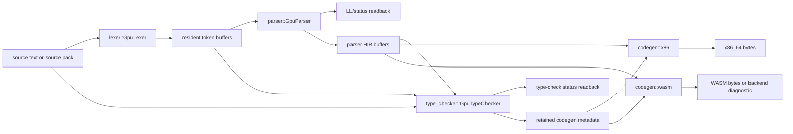

# Compiler Data Flow

This document describes the live data path used by the GPU compiler. It is
written for compiler authors who need to know which phase owns which data and
where phase boundaries are enforced.

## High-Level Pipeline



The central orchestration type is `compiler::GpuCompiler`. It owns initialized
phase drivers and shared parse tables:

- `lexer::GpuLexer`
- `parser::GpuParser`
- `parser::tables::PrecomputedParseTables`
- `type_checker::GpuTypeChecker`
- optional `codegen::wasm::GpuWasmCodeGenerator`
- optional `codegen::x86::GpuX86CodeGenerator`

`GpuCompiler` also owns `resident_pipeline_lock`. Public compile/check paths
take this lock before recording resident frontend/backend work so cached resident
buffers and bind groups are not reused concurrently by incompatible compilations.
See [Compiler orchestration](compiler-orchestration.md) for the target-specific
operation flow, retained buffer wrappers, backend dispatch, and descriptor
worker boundaries.

## Public Entry Points

The main paths are split by operation:

| Operation | Entry point family | Output |
| --- | --- | --- |
| Check/type-check one source | `type_check_source*` | `Result<(), CompileError>` |
| Check/type-check source pack | `type_check_source_pack*` | `Result<(), CompileError>` |
| Compile to x86_64 | `compile_source_to_x86_64*`, `compile_source_pack_to_x86_64*` | ELF/object bytes |
| Compile to WASM | `compile_source_to_wasm*`, `compile_source_pack_to_wasm*` | WASM bytes or backend boundary diagnostic |
| Source-pack workers | `public_execution_api` and `gpu_compiler/source_pack_executor.rs` | manifest/work-queue artifacts |

The source-pack workers use the same phase drivers, but they execute planned
library interface, object, link, and hierarchical link jobs from artifact
manifests or work queues instead of compiling only an in-memory slice.

For the exact current list of operation-facing compiler functions, see
`generated/reference.md` under "Public Compiler Entry Points". That table is
generated from Rust signatures and should be regenerated when public operation
entry points move.
See [Source packs, artifacts, and work queues](source-packs.md) for the persisted
source-pack execution model behind worker-facing entry points.

## Source Preparation

Single-file paths read source text and preserve a diagnostic path. Source-pack
paths keep multiple file bodies and optional file metadata so diagnostics can
map token positions back to the correct source file.

Before in-memory source-pack codegen, `compiler` validates bounded codegen-unit
limits. Larger codebases are expected to use persisted descriptor/work-queue
paths rather than an unbounded in-memory batch.

## Lexing

The lexer input is UTF-8 bytes. `lexer::GpuLexer` loads compact DFA tables from
`tables/lexer_tables.bin` during initialization, prepares packed transition
tables, and records these major passes:

1. source-file boundary marking
2. DFA local scan
3. DFA block summary/prefix application
4. pair scan over token boundaries
5. kept-token and all-token compaction
6. final `GpuToken` construction

Important output buffers:

| Buffer | Meaning |
| --- | --- |
| `in_bytes` | source bytes, kept resident for parser/type-check/codegen diagnostics |
| `tokens_out` | `GpuToken { kind, start, len }` rows |
| `token_count` | number of produced tokens |
| `token_file_id` | source-file id per token for source packs |
| `source_file_start`, `source_file_len` | source-pack file slices |

For compiler paths, the key API is the `with_recorded_resident_*tokens_after_count`
family. It records lexing, obtains token count, then lets the caller record later
phases against resident lexer buffers before final submission/readback handling.

## Parsing And HIR Construction

The parser consumes resident lexer token buffers and precomputed parse tables.
It first estimates or reads projected tree capacity, then records LL/HIR work
with `record_checked_resident_ll1_hir_artifacts_with_tree_capacity`.
See [Parser and HIR](parser.md) for parser ownership, resident-buffer
lifetimes, status words, HIR record families, and the syntax-authoring
checklist.

The parser pipeline has these broad stages:

1. convert lexer token kinds into parser semantic token kinds
2. run LL pair/production passes and pack production streams
3. analyze bracket layers and pair structure
4. recover tree parent/subtree/span/navigation records
5. compact semantic HIR nodes
6. populate typed HIR record arrays for items, types, params, calls, match arms,
   arrays, structs, methods, statements, expressions, and source spans

The parser status row is read after the parser submission boundary. For LL
failures, compiler code maps the status back through token buffers to produce a
source diagnostic before type checking runs.

Important output categories:

| Category | Examples |
| --- | --- |
| Syntax/tree status | `ll1_status`, `projected_status` |
| Tree topology | `node_kind`, `parent`, `first_child`, `next_sibling`, `subtree_end` |
| Semantic HIR topology | `hir_kind`, `hir_semantic_*`, `hir_token_pos`, `hir_token_end`, `hir_token_file_id` |
| Typed HIR rows | `hir_item_*`, `hir_type_*`, `hir_param_*`, `hir_call_*`, `hir_match_*`, `hir_array_*`, `hir_struct_*` |

`compiler/gpu_compiler/buffers.rs` clones selected parser buffers into
`OwnedTypecheckParserBuffers` and `OwnedX86ParserBuffers` before the parser
resident cache is released. This is a critical lifetime boundary: later phases
must only borrow buffers that were explicitly retained.

For the current retained wrappers and other buffer carrier structs, see
`generated/reference.md` under "Buffer Carrier Structs". That generated table is
the quickest way to find where `LaniusBuffer<T>` ownership is retained versus
where raw `wgpu::Buffer` references are only borrowed for recording.

## Type Checking

Type checking is recorded by `type_checker::GpuTypeChecker` from lexer buffers,
retained parser/HIR buffers, and type-check-owned resident state.
See [Resident type checker](type-checker.md) for the resident cache key, pass
families, status contract, and relation-authoring rules.

The first step writes `TypeCheckParams` and clears the main status buffer. Then
the type checker computes or reuses a resident state keyed by:

- source-file capacity
- token capacity
- HIR capacity
- parser HIR capacity
- fingerprints of input buffer identities
- whether HIR control/item metadata is active

The resident state owns bind groups and scratch buffers that can be reused while
those identities and capacities remain valid.

The type-check pass graph is broad, but the phase order is:

1. active HIR dispatch arguments
2. loop-depth and function-context scans
3. language symbol/name/declaration materialization
4. source name collection and radix/dedup assignment
5. module/path record collection, import resolution, visibility, and path
   projection
6. generic parameter and type-instance collection
7. type alias projection and projected type-path reprocessing
8. call row collection, call arg matching, and return/type propagation
9. visible declaration structures
10. method declaration keys, method call resolution, and final method/call row
    application
11. struct/member/array aggregate validation
12. predicate/trait obligation collection and validation
13. final status readback and retained codegen buffer exposure

Errors are reported through status buffers rather than host fallback. The
compiler maps GPU status codes to `CompileError::Diagnostic` when it has enough
token/file data for a primary label.

## Code Generation

Codegen starts only after parser status and type-check status succeed.
See [Codegen and backends](codegen.md) for backend ownership, source-pack
planning, status mapping, and authoring rules.

For x86_64 source packs:

1. parser status is checked
2. semantic HIR count is read
3. parser buffers are retained for x86
4. type checking records and finishes
5. type checker exposes retained `GpuX86CodegenBuffers`
6. x86 backend measures feature usage
7. `record_elf_from_hir` records backend passes against parser HIR plus
   type-check/codegen metadata
8. backend finish maps status/output and returns bytes

The x86 backend consumes both parser-owned HIR records and type-check-owned
semantic metadata: visible declarations, resolved value/type refs, function and
call metadata, type-instance rows, struct/member results, method receiver
metadata, and entrypoint tags.

WASM follows the same frontend shape but is currently expected to fail closed at
the backend boundary for unsupported slices. The WASM code path still matters
because it documents backend boundary diagnostics and shares parser/type-check
metadata wiring with x86.

## Submission And Readback Boundaries

The compiler avoids readback between every pass. Instead it records a group of
passes, submits, and then maps only the status or output buffers required at that
boundary.

Important boundaries:

| Boundary | Why it exists |
| --- | --- |
| token count after lexer | later phases need capacity and dispatch sizing |
| projected parser tree capacity | parser buffers must be sized before HIR recording |
| parser LL/status | syntax errors stop before type checking |
| HIR semantic count | x86 capacity planning needs active semantic HIR count |
| type-check status | codegen must not consume invalid semantic metadata |
| backend status/output | produce final bytes or a backend boundary diagnostic |

## Measuring The Flow

Use two levels of measurement:

1. relationship and ownership measurement
2. runtime phase measurement

For ownership/coupling, use the generated repo map:

```bash
tools/repo_map.py
tools/repo_map.py --svg /tmp/laniusc-repo-map.svg --png /tmp/laniusc-repo-map.png
```

This reports Rust module references, Rust-owned shader groups, Slang import
coupling, test affinity, and largest current areas. It is the fastest way to
see whether a change moved ownership or introduced new coupling.

For exact compiler inventories, use:

```bash
tools/compiler_inventory.py --output docs/compiler/generated/reference.md
tools/compiler_inventory.py --check docs/compiler/generated/reference.md
```

This generated reference covers operation entry points, shader load sites,
type-check pass loaders, type-check record sites, buffer carriers, large
structs, and status-code layouts.

For runtime flow, use `gpu_compile_bench` with a narrow phase:

```bash
cargo run -p laniusc-compiler --bin gpu_compile_bench -- \
  --phase lex --source mixed --lines 500 --warmups 1 --iters 3

cargo run -p laniusc-compiler --bin gpu_compile_bench -- \
  --phase typecheck --source mixed --lines 500 --warmups 1 --iters 3
```

Supported phases are `lex`, `parse`, `typecheck`, `wasm`, and `x86`. Set
`LANIUS_PERFETTO_TRACE=/tmp/lanius-trace.json` to write a Perfetto-compatible
trace-event file. Set `LANIUS_GPU_COMPILE_HOST_TIMING=1` for host-side compiler
phase stamps. Add GPU timing flags only for focused cases; broad readback/timing
can change the profile being measured.

## Buffer Lifetime Rule

Do not assume a parser or lexer scratch buffer is available after its phase just
because the `wgpu::Buffer` still exists. Later phases may intentionally reuse
dead frontend workspaces as scratch. If a backend needs a parser/type-check
value, it must be retained in an owned buffer wrapper or produced by the type
checker as codegen metadata.
