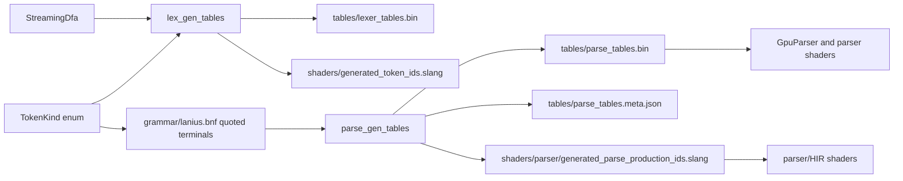

# Grammar And Generated Tables

This chapter documents the compiler-author contract for grammar inputs and
checked-in lexer/parser tables. Use it when a change touches token IDs,
`grammar/lanius.bnf`, `tables/lexer_tables.bin`, `tables/parse_tables.bin`,
`tables/parse_tables.meta.json`, or generated Slang constants.

This is not the command quickstart. Use
[Building and running the compiler](building.md) for commands and
[Maintainer tools and generated inputs](maintainer-tools.md) for tool roles.
This chapter explains which source owns each generated fact, which downstream
code relies on it, and what evidence is needed after changing it.

## Source Ownership

Generated tables are checked into the repo so normal compiler builds can use
stable inputs. They are still derived facts. The source of truth is the Rust,
grammar, and shader code that generates or consumes them.

| Source | Owns |
| --- | --- |
| `lexer::tables::tokens::TokenKind` | Numeric token namespace, grammar terminal names, and generated `TK_*` constants. |
| `lexer::tables::dfa::StreamingDfa` | Byte-level lexer state machine used to build the compact DFA table. |
| `grammar/lanius.bnf` | Start symbol, nonterminals, production order, RHS symbols, and production tags. |
| `parse_gen_tables` | Grammar validation, LL(1) predictions, pair projections, metadata, and generated `PROD_*` constants. |
| `parser::tables::PrecomputedParseTables` | Runtime parser table shape, binary parse-table format, table validation, and test-only CPU oracles. |
| Parser and shader consumers | Meaning of token facts, production IDs, tree/HIR rows, and diagnostics. |

The generated files are evidence that these sources can be serialized. They are
not themselves proof that syntax, HIR, type checking, diagnostics, or backends
still behave correctly.

## Data Flow



This flow has two important consequences:

1. Adding a `TokenKind` does not make the lexer produce it. DFA construction,
   parser token-front-end retags, and downstream HIR consumers still need to
   publish or consume the token.
2. Adding a grammar production does not make the language feature complete.
   Parser HIR, diagnostics, type checking, and target lowering may still need
   records or semantics.

## Lexer Table Contract

`lex_gen_tables` builds two checked-in outputs:

- `tables/lexer_tables.bin`
- `shaders/generated_token_ids.slang`

The binary table begins with `LXDFA001`, then stores:

- `u32` state count
- `u32` reserved flags word
- packed `u16` transition/emission entries for every byte and DFA state
- packed `u16` token ids for every DFA state

`shaders/generated_token_ids.slang` contains `TOKEN_KIND_COUNT`,
`TOKEN_INVALID`, and one generated `TK_*` constant for every
`TokenKind::ALL` entry. `TokenKind` discriminants are the numeric namespace
shared by Rust, grammar terminals, and shader constants.

The lexer table is a byte-state table. It does not own grammar structure.
Contextual retags such as call delimiters, parameter delimiters, path generic
tokens, statement semicolons, and grammar-position identifier roles are parser
token-front-end facts even when they use `TokenKind` ids.

When changing tokens:

1. Update `lexer::tables::tokens::TokenKind`.
2. Update DFA construction only if the byte-level recognition rule changes.
3. Regenerate lexer outputs with `lex_gen_tables`.
4. Update grammar terminals only if the token is part of parser syntax.
5. Update parser token-front-end retags if the token role depends on local
   syntax position.
6. Run focused lexer/parser tests that would fail if the token id, production
   role, or generated shader constant were wrong.

Current token-table tests check the contiguous valid token range, grammar
terminal resolution through `TokenKind::from_name`, generated token constants,
hard-coded shader token constants, and compact table token maps. Those tests
prove table consistency. They do not prove that a source program using the token
is accepted at the language boundary.

## Grammar File Contract

`grammar/lanius.bnf` is a simple BNF-with-tags file. It intentionally avoids
EBNF sugar so production order, empty productions, and tags remain explicit.

Accepted syntax:

- comments begin at `#`
- `%start NonTerminal;` selects the start symbol
- one production per line, ending with `;`
- production form: `lhs [tag] -> rhs;`
- omitted tags default to the LHS name
- terminals are single-quoted `TokenKind` names
- nonterminals are bare identifiers
- an empty RHS is written as nothing after `->`

Example:

```text
%start expr;
expr           -> atom sum;
sum [sum_add]  -> 'InfixPlus' atom sum;
sum [sum_end]  -> ;
atom [int]     -> 'Int';
```

The grammar parser rejects duplicate `%start` directives, malformed production
lines, invalid identifiers, missing semicolons, bad tag syntax, and quoted
terminals that do not resolve through `TokenKind::from_name`.

If the same tag base appears more than once, the generator suffixes later tags
with `#2`, `#3`, and so on. That suffixing only avoids internal duplicate tag
strings. It is not a naming strategy for public production IDs. If shader or
Rust code consumes a production id, give that production a deliberate unique
tag.

## Parser Table Contract

`parse_gen_tables` reads `grammar/lanius.bnf` by default and writes:

- `tables/parse_tables.bin`
- `tables/parse_tables.meta.json`
- `shaders/parser/generated_parse_production_ids.slang`

Before writing tables, the generator validates the grammar boundary:

- undefined nonterminals are fatal
- left recursion is fatal
- LL(1) conflicts are fatal
- unreachable nonterminals are warnings
- pair-projection conflicts are recorded in metadata and summary output

The current generator uses lookback `1` and lookahead `1` for the pair
projection metadata. It also emits full LL(1) prediction and RHS tables for
acceptance/status checks.

`PrecomputedParseTables` stores:

- stack-change supersequence data keyed by `(prev_kind, this_kind)`
- partial-parse production supersequence data keyed by `(prev_kind, this_kind)`
- production arity by production id
- LL(1) prediction cells
- production RHS offsets, lengths, and symbol streams
- nonterminal count and start nonterminal id

The current generator writes the `LXPRSE02` binary format. The loader validates
2D table sizes, production arity size, RHS table sizes, LL(1) prediction table
size, and start-nonterminal range. Do not add another table format or loader
fallback unless a real human maintainer needs to migrate checked-in artifacts
across a coordinated change.

CPU helpers in `parser::tables` are test oracles and diagnostics helpers. They
are not a production fallback parser. The resident compiler path records parser
passes, submits GPU work, reads status, and maps failures through source spans.

## Production Tags And IDs

Production tags are compiler contracts. `parse_gen_tables` converts them into
`PROD_*` constants in
`shaders/parser/generated_parse_production_ids.slang`.

The conversion:

- prefixes the name with `PROD_`
- uppercases ASCII alphanumeric characters
- converts punctuation to underscores
- collapses repeated punctuation separators
- rejects duplicate generated constant names

These constants are consumed by parser and HIR shader code. Renaming a tag is
therefore a behavior change at the shader/Rust boundary, not a documentation
cleanup. When changing a production tag:

1. Update `grammar/lanius.bnf`.
2. Regenerate parse tables and generated production constants.
3. Update every Rust or Slang consumer of the old production id.
4. Run the focused parser/HIR test that would fail if the new production id
   routed to the wrong node or record family.
5. Update docs if the authoring workflow or syntax contract changed.

Do not keep old `PROD_*` names as compatibility aliases unless another human
maintainer explicitly needs a temporary migration path. Unused compatibility is
not neutral: it leaves behind false evidence that both names are meaningful and
makes later table work harder to reason about.

## Metadata Contract

`tables/parse_tables.meta.json` is review and debugging evidence. It records:

- grammar path
- start symbol
- lookback and lookahead values
- grammar diagnostics
- stack-change projection metadata
- partial-parse projection metadata
- LL(1) runtime table shape
- LL(1) predictions
- production ids, source lines, tags, arities, and RHS symbols

Use the metadata when reviewing grammar changes because it exposes shifts that
are easy to miss in binary table diffs. It still does not prove parser/HIR
behavior. A grammar change that writes clean metadata can still misclassify HIR
nodes, produce poor diagnostics, or leave type checking without the records it
needs.

## Changing Syntax

A syntax change usually crosses several boundaries. Keep the table work early,
but do not stop there.

1. Decide whether the source text needs a new token, a parser retag, a grammar
   production, a HIR kind, a typed HIR record, or a type-check-derived relation.
2. Update `TokenKind` and lexer DFA state only if the byte tokenization
   contract changes.
3. Update `grammar/lanius.bnf` when the parse shape changes.
4. Regenerate lexer or parser outputs whose sources changed.
5. Update parser token facts, tree/HIR classification, typed HIR records, and
   retained parser buffers as needed.
6. Update type checking and backend consumers only after the parser publishes
   the syntax fact they need.
7. Add the smallest focused test that proves the changed boundary.
8. Regenerate generated compiler reference docs if public operations, shader
   load sites, record sites, status codes, buffer carrier structs, or Rustdoc
   coverage changed.

The right test depends on the changed boundary:

| Change | Proof shape |
| --- | --- |
| Token id or lexer table shape | Token table tests plus a focused lexer/parser case if source behavior changes. |
| Grammar-only generator logic | `parse_gen_tables` tests for parsing, validation, predictions, projections, or metadata. |
| New production used by HIR | Focused parser/HIR validator with a minimal source program. |
| Syntax diagnostic | Focused diagnostic test that checks source location and code. |
| Downstream semantic feature | Parser/HIR proof plus type-check or backend proof at the owning phase. |

## Common Failure Modes

| Mistake | Better boundary |
| --- | --- |
| Editing generated Slang constants by hand | Update the source enum or grammar tag and regenerate. |
| Adding `TokenKind` without DFA or parser retag support | Decide who produces the token fact and add a focused source-level proof. |
| Treating table generation as syntax acceptance | Run the parser/HIR or diagnostic test that exercises the user-visible syntax. |
| Renaming a production tag without updating shader consumers | Treat the tag as an ABI between grammar metadata and parser/HIR shaders. |
| Adding a loader fallback for convenience | Keep one current format unless another human maintainer needs a migration path. |
| Using CPU table oracles as production behavior | Keep them in tests/debugging; production parsing is the resident parser path. |
| Hiding a grammar ambiguity with downstream special cases | Fix the grammar/table contract or publish the needed parser fact explicitly. |

## Update Rule

Update this chapter when any of the following changes:

- `TokenKind` discriminants or generated token constants
- lexer table binary layout
- grammar file syntax or production-tag policy
- parser table binary layout
- parse-table metadata schema
- production id generation
- parser table validation rules
- the evidence expected after token, grammar, or generated-table changes
