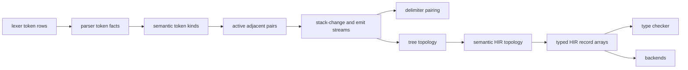

# Parser And HIR

The parser turns resident lexer token rows into parser token facts, LL/pair
streams, tree topology, semantic HIR topology, and typed HIR record arrays. It
does not build a pointer-rich host AST. Later compiler phases consume
parser-owned GPU records directly.

This chapter documents the compiler-author contract for `parser`: what the
parser owns, which buffers cross phase boundaries, how source locations are
preserved, and what to update when adding syntax. For the current shader list,
pass loaders, record sites, buffer carriers, and parser status names, use
`generated/reference.md`.

## Ownership

| Area | Responsibility |
| --- | --- |
| `parser::GpuParser` | Loads parser passes, owns resident parser buffer caches, records parser work, and exposes checked parser/HIR boundaries. |
| `parser::buffers` | Allocates token, pair-stream, bracket, tree, and HIR buffers sized for one resident parse. |
| `parser::tables` | Stores offline LL/pair tables and CPU test oracles for table behavior. |
| `parser::passes` | Wraps shader passes for token facts, active pairs, packed streams, tree recovery, and HIR record construction. |
| `parser::readback` | Converts debug/readback buffers into host vectors and validates parser-owned HIR records in debug paths. |
| `compiler/gpu_compiler/buffers.rs` | Retains selected parser buffers for type checking and codegen after parser cache release. |

The parser owns syntax shape, source spans, and parser-derived facts. Type
checking owns semantic resolution. Codegen owns target lowering. If a new
feature needs semantic policy, add enough parser HIR to describe the syntax,
then resolve it in type checking instead of making parser passes infer language
meaning.

## Public Entry Points

The resident compiler path uses `GpuParser` as a recording boundary rather than
as a function that returns an AST. The important public methods are:

| Method | Purpose |
| --- | --- |
| `read_resident_projected_tree_capacity` | Records the token frontend and projected status work, reads back the exact tree capacity needed by the production stream, and returns at least one row. |
| `projected_resident_tree_capacity` | Computes a conservative capacity from token capacity and parse-table maximum production emission without a GPU readback. |
| `record_checked_resident_ll1_hir_artifacts` | Records token frontend, LL, tree, HIR, literal-source, and status-copy work into a caller-owned encoder. |
| `record_checked_resident_ll1_hir_artifacts_with_tree_capacity` | Same as above, but forces the resident parser cache to allocate the known tree capacity. |
| `with_current_resident_buffers` | Borrows cached parser buffers for the current token/table shape. This is only valid inside the parser lifetime boundary. |
| `with_current_resident_buffers_with_tree_capacity` | Borrows cached parser buffers when the caller already knows the tree capacity. |
| `release_current_resident_buffers` | Drops resident parser buffers and cached bind groups after later phases have cloned what they need. |
| `parse_resident_tokens` | Debug/readback path for resident token buffers. It allocates debug-retention buffers and reads parser-owned records back to the host. |
| `parse` | One-shot debug pipeline over a host token-kind slice. This is useful for tests and diagnostics, not the production compiler path. |

The checked resident entry points return recorded status handles, not immediate
diagnostics. The orchestrator submits a phase boundary, reads parser status, and
maps failures through token/file metadata into `CompileError::Diagnostic`.

## Inputs

The parser depends on three kinds of input:

| Input | Source | Notes |
| --- | --- | --- |
| Token rows | Lexer resident buffers | Lexer token words and token count are resident GPU buffers. The parser never reparses source text for syntax. |
| Token file ids | Lexer/source-pack paths | Optional for single-file paths. If absent, parser clears `default_token_file_id` to zero. |
| Parse tables | `PrecomputedParseTables` | Tables define pair actions, LL prediction, production RHS rows, and production arity. Their fingerprint is part of the resident cache key. |

Literal-value extraction is the one parser operation that can also receive
source bytes. `record_checked_resident_ll1_hir_artifacts_with_tree_capacity`
passes `(source_len, token_buf, source_buf)` into the resident HIR pipeline so
literal record passes can decode values without changing the syntactic owner of
source spans.

## Pipeline

The resident compiler path records these broad stages:

1. Compute token-local facts: delimiter depths/owners, statement context,
   impl/where/match-pattern context, type-path context, and parser semantic
   token kinds.
2. Build active adjacent-pair dispatches and use parse tables to produce pair
   headers.
3. Prefix and pack variable-length stack-change and production streams.
4. Pair delimiter events and validate bracket structure.
5. Recover tree parent/span/sibling/subtree records from the production stream.
6. Classify semantic HIR nodes and compact dense semantic ids.
7. Build semantic navigation records: parent, child, sibling, depth, subtree
   end, token spans, and file ids.
8. Clear and populate typed HIR record families for items, types, params,
   methods, expressions, statements, calls, arrays, enums, matches, structs,
   literals, and context relations.

The pass order is fact table first, consumer second. For example, parameter
links are ranked before method rows read parameter records, function signature
owners are resolved before return-type records, and nearest statement/block/
control context rows are scattered before type checking or codegen consumes
them.

## Token Frontend

The lexer publishes compact token rows. Parser shader passes then derive facts
that are local to syntax but awkward to encode in the lexer:

| Fact group | Examples | Used by |
| --- | --- | --- |
| Delimiter depth and owner | paren/brace/bracket/angle depth, top brace owner, brace match context | pair actions, tree recovery, HIR classification |
| Statement and block context | statement event prefix, statement context kind, brace semantic kind | item/stmt/expr HIR fields |
| Header context | impl headers, where clauses, match patterns, type paths | identifier classification and HIR type/item passes |
| Semantic token kinds | parser-normalized token kind and identifier kind | LL pair tables and HIR node classification |

The token frontend is not semantic name resolution. It may answer "this
identifier appears in a type-path context"; it must not answer "this identifier
resolves to this declaration." That second question belongs to the type checker.

The frontend has its own cached bind groups in
`ResidentTokenKindBindGroups`. The cache is invalidated with resident parser
buffers because the bind groups are tied to concrete token and parser buffer
handles.

## Parse Tables

`PrecomputedParseTables` is the source of truth for parser table data. It stores:

- stack-change supersequence data keyed by `(prev_kind, this_kind)`
- partial-parse production supersequence data keyed by `(prev_kind, this_kind)`
- production arity by production id
- full LL(1) prediction tables used by acceptance/status checks
- production RHS streams for full LL(1) acceptance

The table binary format is little-endian and versioned by magic bytes in
`parser::tables`. CPU helpers in that module are test oracles and diagnostics
helpers, not a fallback parser for production compilation.
The grammar authoring rules, parse-table metadata, production-id generation, and
shader-facing constant contract are documented in
[Grammar and generated tables](grammar-and-tables.md).

Table identity matters at runtime. `GpuParser` fingerprints the tables and
includes that fingerprint in the resident parser cache key. If table contents
change, old resident buffers and parser bind groups are discarded before new
work records against them.

## Resident Buffers

`GpuParser` keeps resident parser buffers behind a cache keyed by:

- token capacity
- parse-table fingerprint
- optional tree-capacity override
- debug-retention mode

The cache is valid only while those inputs match. Later phases must not assume
parser scratch buffers remain live after parser resident buffers are released.

Important buffer groups:

| Group | Examples | Consumer |
| --- | --- | --- |
| Token facts | semantic token kinds, delimiter depths, brace owners, statement context | pair streams and HIR passes |
| Pair streams | action headers, stack-change stream, emit stream, emit token positions | bracket and tree passes |
| Brackets | layer/rank pairing records, `match_for_index`, validity words | tree/HIR validation and debug readback |
| Tree topology | node kind, parent, first child, next/previous sibling, subtree end | HIR classification |
| Semantic HIR | dense node ids, semantic parent/depth/child index, HIR token spans/file ids | type checker, diagnostics, codegen |
| Typed HIR rows | item/type/param/method/expr/call/array/match/struct rows | type checker and backends |

`ParserBuffers` is a large struct because each shader pass binds direct buffers
instead of walking host objects. Do not use its size as a reason to sneak new
policy into unrelated rows. Add a new row when downstream phases need a durable
syntax fact; keep scratch rows private to the pass family that computes them.

The current buffer model still has compatibility-sized dummy expression buffers
next to the authoritative `hir_expr_record`. Treat those as existing debt, not
as a pattern. New compatibility placeholders are a net negative unless another
human maintainer actually depends on the old surface and has a migration path.

## Capacity And Status

Tree capacity is derived from the production emit stream. The fast conservative
projection multiplies the number of adjacent token pairs by the maximum
production emit width in the tables. Some compiler paths first record projected
status work and read the exact capacity before allocating the full tree/HIR
buffers.

The invariant is simple: tree/HIR passes must be recorded only after their
buffers are sized for the production stream they will consume. The explicit
`tree_capacity_override` path exists to enforce that invariant after the exact
readback. Capacity numbers in this section are allocation contracts, not
language limits; use [Capacity and limits](capacity-and-limits.md) before adding
or preserving a parser bound that can reject source.

Parser status uses six words:

| Word | Meaning |
| --- | --- |
| `0` | accepted flag |
| `1` | error token position |
| `2` | parser error code |
| `3` | detail word |
| `4` | step count |
| `5` | production/HIR emission length |

The compiler maps parser status through token buffers to produce
`CompileError::Diagnostic`. A parser error should point at the token or HIR span
closest to the syntactic failure. If a pass can identify a better source
location but only writes a generic failure, the diagnostic is incomplete.

## Source File Identity

Source file identity is part of parser output, not only CLI metadata.
Source-pack paths pass lexer `token_file_id` buffers into parser entry points.
Single-file paths pass no file-id buffer and parser clears
`default_token_file_id` to zero.

The parser carries file identity through several rows:

| Row | Meaning |
| --- | --- |
| `default_token_file_id` | Parser-local token file ids, either copied from lexer or cleared to zero. |
| `hir_token_file_id` | File id for each semantic HIR node, written during HIR node classification. |
| `source_file_token_end` | Maximum token end per file id, used by span propagation. |
| `hir_type_file_id` | Alias of HIR file identity for type rows. |
| `hir_item_file_id` | Alias of HIR file identity for item rows. |

Pair and pack passes read token file ids so adjacent tokens from different
files do not accidentally behave like one source stream. HIR span passes use
`source_file_token_end` to clamp or validate spans inside the owning file. Type
checking and diagnostics then consume `hir_token_file_id`, `hir_type_file_id`,
and `hir_item_file_id` instead of rediscovering file identity from paths.

When adding parser output, preserve file-id flow at the same time as token span
flow. A syntactically correct row with no reliable file id is not complete for
source-pack diagnostics.

## HIR Topology

HIR has two layers:

| Layer | Key rows | Purpose |
| --- | --- | --- |
| Tree topology | `node_kind`, `parent`, `first_child`, `next_sibling`, `prev_sibling`, `subtree_end` | Recovered production tree. This is still parser syntax structure. |
| Semantic HIR topology | `hir_kind`, `hir_semantic_dense_node`, `hir_semantic_parent`, `hir_semantic_first_child`, `hir_semantic_next_sibling`, `hir_semantic_depth`, `hir_semantic_child_index`, `hir_semantic_subtree_end` | Dense semantic view consumed by type checker and backends. |

`hir_nodes` classifies tree nodes into semantic HIR nodes. Semantic prefix and
compact-scatter passes assign dense ids. Navigation passes then build parent,
depth, sibling, child-index, and subtree-end rows over those dense ids.

Do not infer "not in semantic HIR" as "not in the program." Some syntax exists
only to support parse structure, list shape, or source spans. Add semantic HIR
only when later phases need a durable node.

## Typed HIR Records

HIR records are flat arrays, not recursive objects. `hir_kind` identifies
semantic HIR nodes. Typed record families then carry construct-specific facts:

| Family | Rows |
| --- | --- |
| Items | `hir_item_kind`, name/declaration tokens, namespace, visibility, source path, file id, import target kind |
| Types | type form, type value node, length token/value, type file id, type-path leaf rows, type-argument list rows, alias target rows |
| Parameters | parameter record, type node, owner/link/rank/previous rows, segmented parameter id rows |
| Functions and methods | return type node, signature owner rows, method owner/impl/name/receiver/visibility/signature flags |
| Statements and context | statement record, statement scope end, nearest statement/block/control/loop/function rows |
| Expressions | expression record, result node, result-root node, integer literal value, binary/range/index/member span rows |
| Calls | callee node, context statement, argument start/end/count, parent call, ordinal, owner/link/rank rows |
| Arrays | literal first element/count/context, element parent/ordinal/next/previous and owner/link/rank rows |
| Enums and matches | variant parent/ordinal/payload rows, match scrutinee, arms, payload rows, match-rank rows |
| Structs | declaration field rows, struct literal head/context, literal field rows, owner/link/rank rows |

The parser pass bundle makes these families explicit. For example:

- `hir::nodes` owns HIR classification.
- `hir::semantic` owns dense HIR topology and navigation.
- `hir::types`, `hir::functions`, `hir::method`, and `hir::param` own type and
  signature rows.
- `hir::item` owns item identity rows, but module/path resolution belongs to
  type-checker module-path passes.
- `hir::context`, `hir::stmt_fields`, and `hir::stmt_scope` own local syntactic
  context rows.
- `hir::call`, `hir::array`, `hir::enums`, `hir::matches`, and `hir::structs`
  own list-like relation rows and ordinal/rank rows.

List-like families use owner/link/rank passes before scatter passes. This is the
same pattern used for type arguments, parameters, call arguments, array
elements, enum variants, match arms, match payloads, struct fields, and struct
literal fields. When adding a list family, keep the intermediate owner/link/rank
buffers local to parser and publish only the durable rows downstream phases
need.

Downstream phases rely on parser rows being self-consistent. Debug readback
validates many invariants: no orphan list links, no cross-file call argument
edges, no duplicate argument ordinals, bounded enum payload rows, source spans
inside owner spans, and type rows that point only at parser-owned type nodes.

## Retained Parser Buffers

The resident parser cache can be released as soon as later phases have cloned
the parser rows they need. The clone boundary is explicit:

| Wrapper | Consumer | Contract |
| --- | --- | --- |
| `OwnedTypecheckParserBuffers` | Type-check recording and diagnostics | Clone every parser buffer the type checker binds or uses for diagnostic mapping. |
| `OwnedX86ParserBuffers` | x86 feature measurement, lowering, and backend diagnostics | Clone only parser rows required after type checking has started or parser cache has been released. |
| `OwnedX86DiagnosticBuffers` | x86 diagnostic mapping | Clone lexer token rows needed to map backend status back to source. |

When adding a parser row for type checking or codegen, update the retained
wrapper at the phase boundary. Do not keep the parser cache alive longer as an
implicit dependency. A longer borrow hides ownership, increases resident memory
pressure, and makes release timing harder to reason about.

## Debug Readback

Debug readback is intentionally separate from the hot path. Parser readback
allocates staging buffers, copies many parser-owned rows, maps them to host
vectors, and runs validators. This is valuable for understanding HIR shape but
too expensive to treat as normal compilation. See
[Parser readback and HIR validators](parser-readback.md) for the readback
surfaces, live-length rules, and validator contracts.

Use readback when:

- developing a parser pass
- proving a new HIR record family is internally consistent
- diagnosing a source-location or file-id bug
- checking an invariant that cannot yet be asserted through normal diagnostics

Do not use readback as the only way to make a downstream phase work. If type
checking or codegen needs the fact, it belongs in resident parser output and in
the retained wrapper for that phase.

## Performance Rules

The parser is parallel because its hot data structures are flat buffers and
because list-like relation work is expressed as scans, scatters, and bounded
step passes. Preserve that shape:

- Prefer prefix scans, compact-scatter passes, and indirect dispatch over
  host-side loops.
- Keep tree-capacity sizing explicit before HIR work records.
- Keep token frontend facts local and reusable instead of recomputing context
  in every HIR family.
- Use compute-pass batching only when it records the same work with fewer pass
  boundaries; it must not change buffer ownership or pass dependencies.
- Avoid new per-node shader loops whose trip count grows with source length
  unless there is a documented algorithmic bound and a focused performance
  check.

The parser already has bounded step families for semantic parent/depth/child
index, type-path leaf links, type arguments, parameters, enum variants, match
arms, array elements, struct fields, and context relations. If a new feature
looks like "walk upward until you find X" or "scan siblings until Y", first look
for an existing owner/link/rank or parent-step pattern before adding a loop.

## Adding Syntax

Use this checklist for parser changes:

1. Decide whether the feature needs a parser token fact, a new tree/HIR kind, a
   field on an existing HIR record family, a new list-like relation, or a
   type-check derived relation.
2. Update grammar, parse tables, production arity, and generated production
   constants if the grammar shape changes; use
   [Grammar and generated tables](grammar-and-tables.md) for the table contract.
3. Add token frontend context only when raw lexer tokens do not carry enough
   local information for table/HIR consumers.
4. Add HIR record rows before downstream phases need them.
5. Preserve token file id and token span flow for diagnostics.
6. Add retained parser buffers if type checking or codegen needs the new rows.
7. Add readback validation for parser-owned invariants that normal diagnostics
   cannot prove; use [Parser readback and HIR validators](parser-readback.md)
   to choose the narrowest surface.
8. Add a focused parser/HIR test with the smallest source that exercises the new
   row or status behavior.
9. Regenerate `docs/compiler/generated/reference.md`.

Do not reconstruct syntax in type checking or codegen if the parser should have
published it. Do not encode semantic resolution in parser passes only because a
syntax visitor is already near the data.

## Common Mistakes

| Mistake | Better boundary |
| --- | --- |
| Adding a type-check rule to token frontend context | Publish the syntax fact in parser HIR and resolve semantics in type checking. |
| Reading parser scratch rows after `release_current_resident_buffers` | Clone the required rows into `OwnedTypecheckParserBuffers` or `OwnedX86ParserBuffers`. |
| Adding a source-pack feature without updating file-id rows | Preserve `default_token_file_id`, `hir_token_file_id`, and typed row aliases with the new syntax. |
| Treating debug readback fields as the public contract | Bind resident parser buffers directly or add retained wrapper fields. |
| Extending compatibility dummy rows | Remove the old surface or document the actual human migration need before keeping compatibility. |
| Fixing a parser diagnostic only in CLI rendering | Write a better parser status position/detail or HIR span so all diagnostic renderers benefit. |

## Evidence To Update

When parser behavior changes, keep these evidence paths current:

- `docs/compiler/generated/reference.md` for pass loaders, shader imports,
  buffer carrier structs, large structs, and status layouts
- focused parser/HIR tests for the smallest source that exercises the new
  syntax shape
- diagnostics tests when parser status, token position, file id, or span
  mapping changes
- source-pack tests when token/HIR file identity changes
- performance checks when a new pass, bounded step family, scan, or shader loop
  changes parser runtime characteristics

For docs-only edits to this chapter, `tools/compiler_inventory.py --check
docs/compiler/generated/reference.md`, Markdown link checking, whitespace
checks, and ASCII checks are enough. Compiler tests are only needed when the
parser code or generated reference inputs change.
